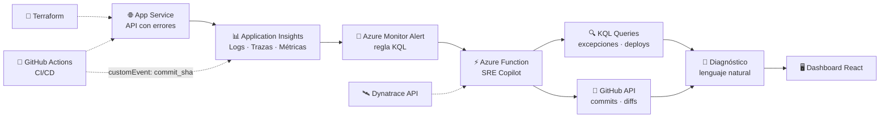

# 🤖 SRE Copilot

> **Diagnóstico de incidentes asistido por IA.** Cuando tu app explota con un HTTP 500 a las 3 a.m., SRE Copilot correlaciona logs, trazas, métricas y commits de GitHub para decirte *qué se rompió, cuándo y quién lo desplegó* — en segundos, no en horas.

<p align="center">
  
  
  
  
  
</p>

---

## 🧠 ¿Por qué existe?

Cuando una aplicación falla, los equipos de SRE pierden **horas** haciendo detective manual entre:

- 🕵️ Logs y excepciones dispersos en Application Insights
- 📉 Métricas de latencia y disponibilidad
- 🔀 Trazas distribuidas entre dependencias
- 🗂️ Historial de deploys y commits recientes

**SRE Copilot automatiza esa investigación.** Detecta la anomalía, ejecuta consultas KQL, cruza la evidencia con el historial de GitHub y entrega un diagnóstico en lenguaje natural.

> *"El error 500 empezó tras el deploy del commit `a3f21bc`, causado por una cadena de conexión mal configurada en el App Service."*

---

## ⚡ Cómo funciona



---

## 🗺️ Flujo del diagnóstico (paso a paso)

| Paso | Componente | Qué hace |
|---|---|---|
| 1️⃣ | **Terraform** | Despliega Resource Group, App Service, Application Insights, Azure Function y Key Vault |
| 2️⃣ | **GitHub Actions** | Publica la app y envía un `customEvent` a App Insights con `commit_sha`, versión y timestamp |
| 3️⃣ | **Azure Monitor Alert** | Regla KQL: *">5 excepciones en 5 minutos"* → dispara webhook hacia la Function |
| 4️⃣ | **Azure Function (Copilot)** | Corre las consultas de evidencia y cruza con GitHub |
| 5️⃣ | **Frontend React** | Muestra causa raíz, commit sospechoso, timeline y recomendación |

### 🔍 Consultas KQL clave

```kusto
// ¿Qué se está rompiendo y dónde?
exceptions
| where timestamp > ago(15m)
| summarize count() by type, outerMessage, operation_Name
| order by count_ desc

// ¿Coincide con algún deploy reciente?
customEvents
| where name == "Deploy"
| top 1 by timestamp desc
| project commit_sha = tostring(customDimensions.commitSha), deployedAt = timestamp
```

---

## 🛠️ Stack tecnológico

| Capa | Tecnología |
|---|---|
| ☁️ Cloud | Azure (App Service, Functions, Monitor, Key Vault) |
| 📦 Infraestructura | Terraform (IaC) |
| 🔁 CI/CD | GitHub Actions |
| 🔎 Observabilidad | Application Insights · KQL · Dynatrace API |
| ⚙️ Backend | Node.js + Azure Functions |
| 🖥️ Frontend | React + Vite |
| 🗝️ Secretos | Azure Key Vault |

---

## 🚀 Quickstart

```bash
# 1. Clona el repositorio
git clone https://github.com/FerminGonzalez/SRE-Copilot.git
cd SRE-Copilot

# 2. Despliega la infraestructura
cd infrastructure
terraform init
terraform apply

# 3. Lanza el backend local
cd ../backend
npm install && npm run dev

# 4. Lanza el frontend
cd ../frontend
npm install && npm run dev
```

---

## 📁 Estructura del proyecto

```
SRE-Copilot/
├── infrastructure/      # Terraform: RG, App Service, Insights, Function, Key Vault
├── backend/             # API de ejemplo (con errores a propósito 😉)
├── copilot-function/    # Azure Function: motor de diagnóstico
├── frontend/            # Dashboard React del diagnóstico
└── .github/workflows/   # CI/CD con customEvent de deploy
```

---

## 🎯 Estado del proyecto

- [x] Definición de arquitectura y flujo de alertas
- [ ] Infraestructura como código (Terraform)
- [ ] Backend con errores instrumentados
- [ ] Consultas KQL de diagnóstico
- [ ] Correlación con GitHub API
- [ ] Diagnóstico en lenguaje natural
- [ ] Dashboard React

---

<p align="center">
  🏗️ Proyecto en desarrollo para <b>Hackathon Cloud & Observability</b> · Azure + Terraform + KQL + Dynatrace
</p>
